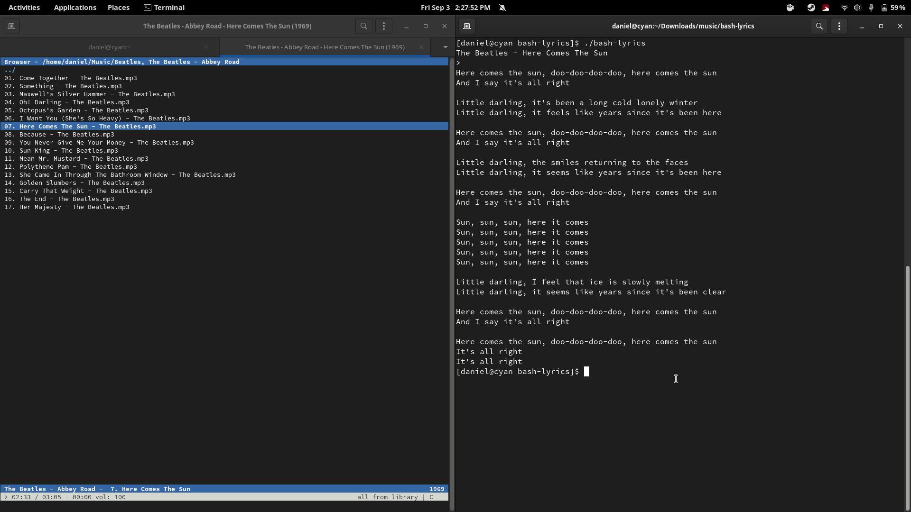

# bash-lyrics
An extension of the [music-status-bash](https://github.com/dhonus/music-status-bash) script. Takes current playing song, searches for in on azlyrics and parses the output to cli.
## Installation
Does not really require any dependencies, simply download or use following curl command
### Optional dependencies
If you intend to use this script with web-based players such as Tidal, or anything else in the browser -- install **`playerctl`**

### Install steps
To clone this script into a directory and mark it as executable run the following commands 

`curl https://raw.githubusercontent.com/dhonus/bash-lyrics/main/bash-lyrics >> bash-lyrics`

 `chmod +x bash-lyrics`

 `./bash-lyrics`

---

## Supported players
As a very small fork of neofetch(yes), it supports most common audio players. Full list below.

* web based players in chromium based browsers (only tested in Brave)
* Spotify
* amarok
* audacious
* banshee
* bluemindo
* clementine
* cmus
* deadbeef
* deepin-music
* dragon
* elisa
* exaile
* gnome-music
* gmusicbrowser
* gogglesmm
* guayadeque
* io.elementary.music
* iTunes
* juk
* lollypop **currently bugged** and disabled in this version
* MellowPlayer
* mocp
* mopidy
* mpd
* muine
* netease-cloud-music
* olivia
* plasma-browser-integration
* playerctl
* pogo
* pragha
* qmmp
* quodlibet
* rhythmbox
* sayonara
* smplayer
* strawberry
* tauonmb
* tomahawk
* vlc
* xmms2d
* xnoise
* yarock
